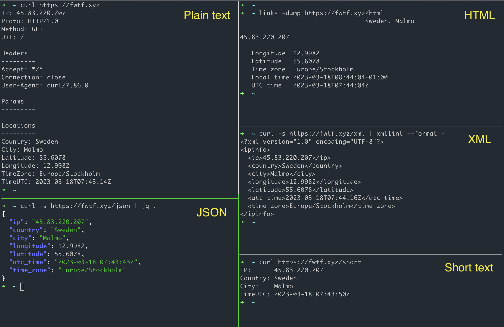

# IPINFO


IP info web service. It handles the following requests:

1. default (`/` and any other path) - plain text info about request IP
2. `/short` - short info about request IP
3. `/compact` - compact info about request IP
4. `/json` - json info about request IP
5. `/xml` - xml info about request IP
6. `/html` - html info about request IP
7. `/full` - full html info about request IP with links to other formats
8. `/ip` - only request IP address
9. `/version` - version info, without GeoIP lookup
10. `/health` - liveness check, returns `OK` without GeoIP lookup

Any format accepts the query parameter `ip` to show info about another address instead of
the request IP, e.g. `/json?ip=8.8.8.8` or `/ip?ip=::ffff:8.8.8.8`. An empty value is ignored,
an invalid one returns `400 Bad Request`. The links of the `/full` page keep this parameter.

Examples are in the file [api.md](api.md).



## Build

```bash
make build
# cp config.example.json ipinfo.json
# set custom settings in ipinfo.json
./ipinfo -config ipinfo.json
```

For docker container [z0rr0/ipinfo](https://hub.docker.com/r/z0rr0/ipinfo):

```bash
# build the image for the host architecture
make docker

# build linux/amd64 + linux/arm64 and push them to Docker Hub,
# tagged as latest and as the current git tag
make docker-push
```

## Local run

```bash
make start
make stop

# alias for [stop + start]
make restart
```

For docker container:

```bash
# /mydir/ipinfo.json
# /mydir/GeoLite2-City.mmdb
docker run --rm --name ipinfo -u $UID:$UID -p 8082:8082 -v /mydir:/data/conf:ro z0rr0/ipinfo:latest
```

Or with [docker-compose.yml](docker-compose.yml), which mounts `./data` as `/data/conf`:

```bash
# data/ipinfo.json
# data/GeoLite2-City.mmdb
docker compose up -d
docker compose down
```

The config inside the container needs `"host": "0.0.0.0"` (`127.0.0.1` is not
reachable through the published port) and `"db": "/data/conf/GeoLite2-City.mmdb"`.

The compose service has a healthcheck that requests `/health` on port `8082`;
keep it in sync with `port` in `data/ipinfo.json`.

## Configuration

See [config.example.json](config.example.json). Optional field `ip_itself`: when set,
requests coming from an internal private or loopback address (e.g. another docker
container on the same host) have their IP replaced by this value before geolocation,
so they report the host's real public IP. Leave it empty to disable.

## License

This source code is governed by a [BSD 3-Clause](https://opensource.org/licenses/BSD-3-Clause)
license that can be found in the [LICENSE](https://github.com/z0rr0/ipinfo/blob/master/LICENSE) file.

_This product includes GeoLite2 data created by MaxMind, available from [https://www.maxmind.com](https://www.maxmind.com)._
