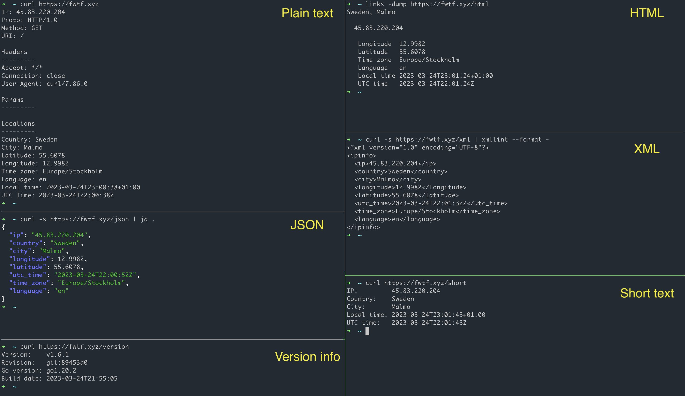

# IPINFO


IP info web service. It handles next requests:

1. default - plain text info about request IP
2. `/short` - short info about request IP
3. `/json` - json info about request IP
4. `/xml` - json info about request IP
5. `/html` - html info about request IP

Examples are in the file [api.md](api.md).



### Build

```bash
make build
# cp config.example.json ipinfo.json
# set custom settings in ipinfo.json
./ipinfo -config ipinfo.json
```

For docker container [z0rr0/ipinfo](https://hub.docker.com/r/z0rr0/ipinfo)

```bash
make docker
# or only for linux amd64
# make docker_linux_amd64
```

### Local run

```bash
make start
make stop

# alias for [stop + start]
make restart
```

For docker container

```bash
# mydir/ipinfo.json
# mydir/GeoLite2-City.mmdb
docker run --rm --name ipinfo -u $UID:$UID -p 8082:8082 -v /mydir:/data/conf:ro z0rr0/ipinfo:latest
```

### License

This source code is governed by a [BSD 3-Clause](https://opensource.org/licenses/BSD-3-Clause) 
license that can be found in the [LICENSE](https://github.com/z0rr0/ipinfo/blob/master/LICENSE) file.

_This product includes GeoLite2 data created by MaxMind, available from [http://www.maxmind.com](http://www.maxmind.com)_
